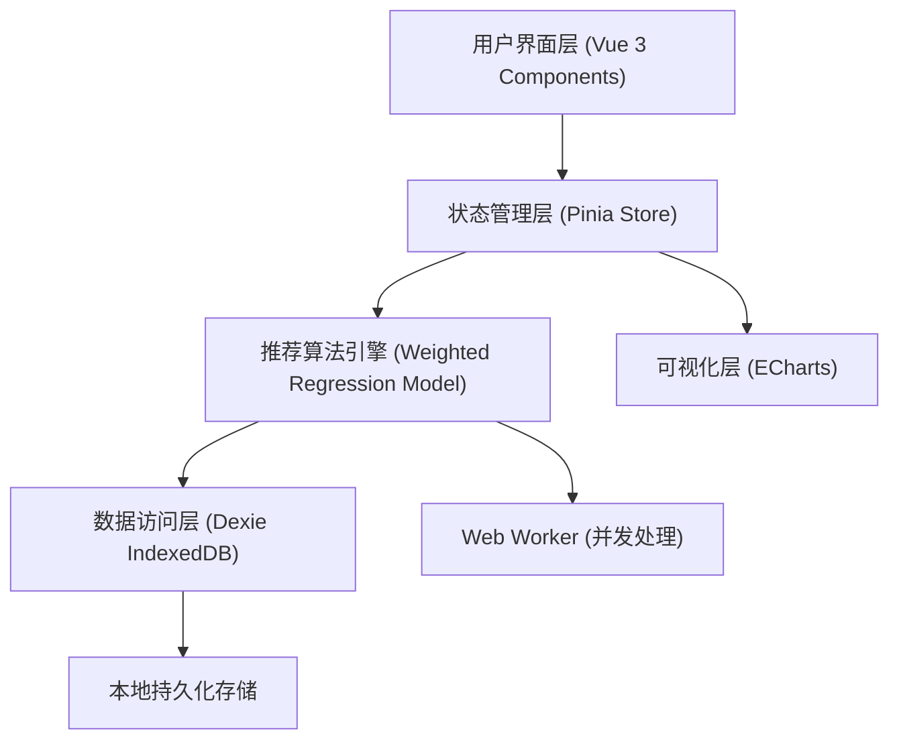
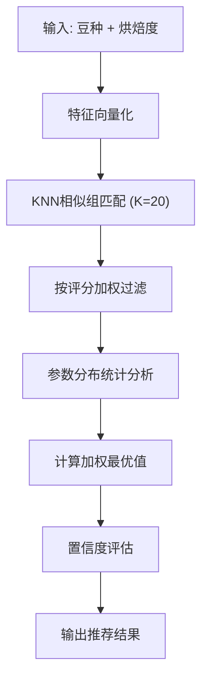

# 技术架构文档 - 萃取参数智能推荐系统

## 1. 总体架构



### 架构风格
- **单页应用 (SPA)**：Vue 3 + Vite 构建
- **本地优先 (Local-First)**：IndexedDB 存储，离线可用
- **响应式数据**：Pinia 状态管理
- **模块化设计**：按职责分层

## 2. 技术栈选型

| 层级 | 技术选型 | 说明 |
|------|----------|------|
| 前端框架 | Vue 3 (Composition API) | 响应式、高性能 |
| 构建工具 | Vite 6 | 快速构建、HMR |
| 状态管理 | Pinia 2.3 | Vue官方推荐、TypeScript友好 |
| 本地数据库 | Dexie 4.0 | IndexedDB封装、Promise API |
| 图表库 | ECharts 5.6 + vue-echarts 7 | 丰富图表类型 |
| 并发处理 | Web Worker | 算法计算不阻塞UI |

## 3. 数据模型设计

### 3.1 核心数据表

#### extraction_params（萃取参数历史数据）
```javascript
{
  id: Number,              // 主键自增
  beanType: String,        // 豆种大类：阿拉比卡/罗布斯塔/混合
  beanVariety: String,     // 具体品种：耶加雪菲/瑰夏/曼特宁等
  origin: String,          // 产地
  process: String,         // 处理法：水洗/日晒/蜜处理/湿刨
  roastLevel: String,      // 烘焙程度
  ratio: Number,           // 粉水比（分母值，如15表示1:15）
  temperature: Number,     // 水温（℃）
  brewTime: Number,        // 萃取时间（分钟）
  overallScore: Number,    // 综合评分 1-5
  acidityScore: Number,    // 酸度 1-10
  sweetnessScore: Number,  // 甜度 1-10
  bodyScore: Number,       // 醇厚度 1-10
  aftertasteScore: Number, // 余韵 1-10
  balanceScore: Number,    // 平衡度 1-10
  sampleCount: Number,     // 该组参数的验证次数
  createdAt: ISOString,
  updatedAt: ISOString
}
```

#### recommendation_feedbacks（推荐反馈）
```javascript
{
  id: Number,
  paramRecordId: Number,   // 关联的参数记录
  beanVariety: String,
  roastLevel: String,
  recommendedRatio: Number,
  recommendedTempMin: Number,
  recommendedTempMax: Number,
  recommendedTimeMin: Number,
  recommendedTimeMax: Number,
  actualUsed: Boolean,     // 是否实际使用了推荐参数
  satisfaction: Number,    // 用户满意度 1-5
  feedback: String,        // 文字反馈
  createdAt: ISOString
}
```

## 4. 推荐算法设计

### 4.1 算法流程



### 4.2 核心算法

#### 4.2.1 特征相似度计算
```
similarity = w1 * beanTypeMatch + w2 * varietyMatch + w3 * roastLevelMatch + w4 * processMatch
权重: w1=0.25, w2=0.35, w3=0.30, w4=0.10
```

#### 4.2.2 烘焙度距离
```
烘焙度编码: 极浅=0, 浅=1, 中浅=2, 中=3, 中深=4, 深=5, 极深=6
roastLevelMatch = 1 - |levelA - levelB| / 6
```

#### 4.2.3 加权回归计算最优参数
```
对每个参数维度（粉水比/水温/时间）:
1. 取 Top-K 相似记录
2. 按 (相似度 * 综合评分)^2 加权
3. 计算加权均值 μ 和加权标准差 σ
4. 推荐值 = μ，推荐区间 = [μ-σ, μ+σ]（取整/一位小数）
5. 置信度 = 1 - (σ/μ) * 稀疏惩罚因子
```

#### 4.2.4 稀疏数据处理
- 当相似记录数 < 5 时，采用贝叶斯先验平滑
- 引入豆种大类的先验参数分布作为兜底

### 4.3 Web Worker 并发处理
- 算法计算运行在独立 Worker 线程
- 支持批量请求队列
- 消息传递使用结构化克隆，避免大对象拷贝开销

## 5. 模块设计

### 5.1 文件结构
```
src/
├── stores/
│   └── extractionParams.js    # 萃取参数推荐 Store
├── components/
│   ├── ExtractionParamsInput.vue     # 参数输入组件
│   ├── ExtractionParamsResult.vue    # 推荐结果展示
│   ├── ExtractionParamsFeedback.vue  # 评分反馈组件
│   ├── ExtractionParamsCharts.vue    # 数据可视化图表
│   └── ExtractionRecommendation.vue  # 主页面组件
├── workers/
│   └── recommendation.worker.js # 推荐算法 Worker
├── utils/
│   └── recommendationAlgo.js   # 推荐算法核心函数
├── db.js                        # 数据库表扩展
└── seed.js                      # 种子数据扩展
```

### 5.2 Store API
```javascript
useExtractionParamsStore
  ├─ state:
  │   ├─ paramHistory: Array     # 历史参数数据
  │   ├─ feedbacks: Array        # 反馈数据
  │   ├─ currentRecommendation: Object
  │   └─ isComputing: Boolean
  ├─ actions:
  │   ├─ loadAll()
  │   ├─ recommend(beanVariety, roastLevel)
  │   ├─ addParamRecord(record)
  │   ├─ submitFeedback(feedback)
  │   └─ batchTestCombinations()
  └─ getters:
      ├─ getStatsByRoastLevel
      ├─ getSatisfactionTrend
      └─ totalCombinationsTested
```

## 6. 性能优化策略

### 6.1 算法性能
- 相似组匹配使用预计算的特征索引哈希
- 按 (beanType, roastLevel) 建立二级索引加速查询
- 计算结果缓存：相同输入 5 分钟内复用

### 6.2 UI性能
- 图表组件按需懒加载
- 大数据列表使用虚拟滚动
- 状态更新批量处理

### 6.3 并发处理
- Web Worker 消息队列化
- 1000并发请求分批处理（每批 50 个）
- 使用 SharedArrayBuffer 共享权重参数（可选）

## 7. 测试验证方案

### 7.1 100种组合测试
- 预设 100+ 种豆种+烘焙度组合
- 每种组合运行推荐算法
- 验证输出格式正确性（粉水比一位小数、温度整数、时间分钟）
- 计算平均置信度和参数合理性

### 7.2 满意度基准
- 种子数据模拟 ≥ 4.0 平均分
- 内置测试套件：随机采样 30 条真实数据，预测值与实际值偏差 < 10%
